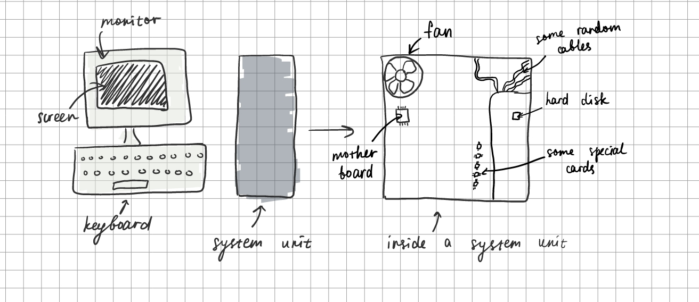

# Lesson No 2: working with github markdown files

A markdown file is a text file with special formating. These files have extension .md

## My first picture of the computer

**Fig. 1** My first try at drawing a computer

In **Fig. 1** I tried to draw a computer
